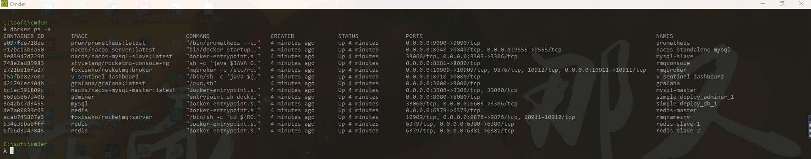

# 简化部署方案：

> 需要安装docker和docker-compose 启动docker服务在项目根目录下执行一下命令即可

```
docker-compose -f ./simple-deploy/beautiful-leg-simple.yaml up -d
docker-compose -f ./simple-deploy/beautiful-leg-single.yaml up -d
```

> 停止服务在项目根目录下执行一下命令即可: 

```
docker-compose -f ./simple-deploy/beautiful-leg-simple.yaml down
docker-compose -f ./simple-deploy/beautiful-leg-single.yaml down
```

> windows版本安装docker服务获取磁盘读写权限问题的坑... 

> 解决办法引用: https://blog.csdn.net/u012680857/article/details/77970351

> 服务包含:

* nacos注册中心服务: http://localhost:8848/nacos
* nacos_mysql集群服务: jdbc://localhost:3306(master)
* nacos_mysql集群服务: jdbc://localhost:3305(slave)
* prometheus监控服务: http://localhost:9090
* grafana数据监控统计服务: http://localhost:3000
* mysql服务: jdbc://localhost:6603(root/123456)
* mysql_adminer服务: http://localhost:8080
* redis集群服务: redis://localhost:6379(master)
* redis集群服务: redis://localhost:6380(slave1)
* redis集群服务: redis://localhost:6381(slave2)
* rocketMq服务: rocketMq://localhost:9876
* rocketMq控制台服务: http://localhost:8181
* sentinel控制台服务: http://localhost:8718
* sentinel限流服务: sentinel://localhost:8720

> 命令行输入docker ps -a显示如下服务即是成功启动服务：



> 在启动dubbo服务时(下面的UmsAdminProviderApplication服务),需要在 JVM 中添加以下启动参数:

```
  -Djava.net.preferIPv4Stack=true
  -Dcsp.sentinel.api.port=8720
  -Dproject.name=ums-admin-provider
  -Dcsp.sentinel.dashboard.server=127.0.0.1:8718
```
> 提交回退

```
git rm --cached -r useless
git commit -m "remove directory from remote repository"
git push

docker container prune -f
```

> 应用部署

```
docker-compose -f ./simple-deploy/beautiful-leg-admin.yaml up -d
docker-compose -f ./simple-deploy/beautiful-leg-admin.yaml down
docker rmi business-oauth2 gateway cloud-upload business-reg business-profile admin-login admin-ums 
```
